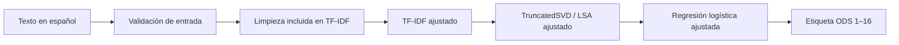

# Clasificador de textos por ODS

Aplicación Streamlit que clasifica textos en español según las etiquetas ODS `1` a `16`. Utiliza el pipeline ajustado y exportado por [`Taller_ODS_Textos_LSA_Clasificacion_Completo_Ejecutado.ipynb`](../3-Microproyecto2/Taller_ODS_Textos_LSA_Clasificacion_Completo_Ejecutado.ipynb).

## Estado actual

La aplicación recibe un texto crudo, valida que sea una cadena no vacía y lo entrega al pipeline completo:



Durante la inferencia no se ejecuta `fit` ni `fit_transform`. La limpieza tampoco se aplica desde `DataPreprocessing`: el `TfidfVectorizer` del pipeline llama al preprocesador exportado, evitando transformar el texto dos veces.

Al pulsar **Predecir ODS**, se muestra también una nube de palabras del texto ingresado,
identificada con el ODS predicho. El tamaño de las palabras representa su peso TF-IDF
con el vocabulario y la limpieza del modelo entrenado. Es un resumen del texto, no una
explicación de la contribución de cada palabra a la clase ni una medida de confianza.
La nube muestra hasta 80 términos y se actualiza con cada clasificación. Si no hay
términos reconocidos, se muestra un aviso en lugar de una imagen vacía.
Se genera con [WordCloud](https://amueller.github.io/word_cloud/generated/wordcloud.WordCloud.html),
incluido en las dependencias.

## Del flujo anterior al pipeline ODS

Los tres artefactos anteriores pertenecen a un clasificador de imágenes y se conservan en `resources/models/` como legado:

| Archivo anterior | Objeto comprobado | Función prevista |
| --- | --- | --- |
| `scaler.joblib` | `StandardScaler`, 784 características `pixel1`–`pixel784` | Estandarizar valores de píxeles. |
| `pca.joblib` | `PCA`, 784 entradas y 115 componentes que conservan 95% de varianza | Reducir la representación numérica de las imágenes. |
| `model.joblib` | `KNeighborsClassifier`, 115 entradas | Clasificar la representación reducida en índices de letras. |

El código anterior solamente definía sus rutas y dejaba los tres objetos en `None`; su integración estaba marcada como `TO-DO`. La interfaz esperaba un CSV con una etiqueta seguida por 784 píxeles.

El nuevo [`ods_text_lsa_classifier.joblib`](resources/models/ods_text_lsa_classifier.joblib) contiene un único `sklearn.pipeline.Pipeline` ajustado:

1. `tfidf`: `TfidfVectorizer` con máximo 5000 términos, unigramas, vocabulario e IDF aprendidos.
2. `dimred`: `TruncatedSVD` con 150 componentes, utilizado como LSA sobre TF-IDF.
3. `model`: `LogisticRegression` con `C=1.0`, que predice directamente las etiquetas ODS originales `1`–`16`.

No se usó `LabelEncoder`. LSA mediante `TruncatedSVD` no es el PCA anterior, y el texto TF-IDF no necesita el `StandardScaler` de píxeles.

El pipeline incorpora una referencia al preprocesador y una copia congelada de las 48 stopwords usadas al entrenar. El archivo `.joblib` **no es autónomo por sí solo**: requiere [`ods_text_preprocessing.py`](ods_text_preprocessing.py) importable y las versiones compatibles de joblib, NLTK, NumPy, SciPy y scikit-learn. No necesita descargar el corpus de stopwords de NLTK porque la lista está serializada dentro del pipeline.

Los metadatos en [`ods_text_lsa_classifier.metadata.json`](resources/models/ods_text_lsa_classifier.metadata.json) documentan el formato de entrada, las clases, el orden de transformación, las versiones de exportación, ejemplos verificados y el hash SHA-256 del modelo. `ModelController` comprueba ese hash y el contrato del pipeline al iniciar.

## Estructura

```text
5-UNIANDES-MAIA-MLNS--ODS-2026-g26/
├── streamlit_app.py
├── Definitions.py
├── ods_text_preprocessing.py
├── requirements.txt
├── requirements.lock.txt
├── src/
│   ├── DataPreprocessing.py
│   └── ModelController.py
├── tests/
│   ├── test_model_controller.py
│   └── test_streamlit_app.py
└── resources/
    ├── batch/streamlit.bat
    └── models/
        ├── ods_text_lsa_classifier.joblib
        ├── ods_text_lsa_classifier.metadata.json
```

## Instalación y ejecución

El artefacto se exportó con Python 3.9.6 y scikit-learn 1.3.2. El entorno local del proyecto usa Python 3.11.16 con las mismas versiones relevantes del modelo.

Desde la raíz del repositorio:

```bash
cd "5-Analisis de textos/5-UNIANDES-MAIA-MLNS--ODS-2026-g26"
python3.11 -m venv .venv
.venv/bin/python -m pip install -r requirements.txt -c requirements.lock.txt
.venv/bin/python -m streamlit run streamlit_app.py
```

La aplicación queda disponible en <http://127.0.0.1:8501>. La configuración local está en [`.streamlit/config.toml`](.streamlit/config.toml).

## Contrato de inferencia

`ModelController.predict(text)` recibe una cadena en español sin preprocesar y devuelve un `int` entre 1 y 16. `predict_many(texts)` recibe una secuencia no vacía de cadenas y devuelve una lista de enteros.

```python
from src.ModelController import ModelController

controller = ModelController()
predictions = controller.predict_many([
    "La educación inclusiva amplía las oportunidades de aprendizaje.",
    "El acceso al agua potable mejora la salud de las comunidades.",
])
print(predictions)
```

Las cadenas vacías o compuestas únicamente por espacios producen `ValueError`. Los valores que no sean cadenas producen `TypeError`. No se asigna una categoría a entradas inválidas.

## Pruebas

```bash
.venv/bin/python -m pip check
.venv/bin/python -m unittest discover -s tests -v
```

Las pruebas comprueban:

- La carga del artefacto y la coincidencia de su SHA-256.
- Los pasos `tfidf → dimred → model` y las etiquetas `1`–`16`.
- Las predicciones `[4, 6, 15]` registradas al exportar el notebook.
- Una predicción individual con salida `int`.
- El rechazo de textos vacíos, `None`, números, lotes vacíos y elementos inválidos.
- La carga de Streamlit y los flujos de texto válido y vacío.

## Responsabilidades y modificaciones futuras

| Cambio | Archivo principal | Validación relacionada |
| --- | --- | --- |
| Contrato y validación de entradas | `src/DataPreprocessing.py` | Casos válidos, vacíos y tipos incorrectos. |
| Carga, integridad y predicción | `src/ModelController.py` | Hash, pasos, clases y predicciones de referencia. |
| Limpieza textual serializada | `ods_text_preprocessing.py` y notebook de entrenamiento | Volver a exportar y comparar predicciones; no cambiar solo una copia. |
| Modelo o metadatos | `resources/models/` | Mantener `.joblib` y JSON del mismo proceso de exportación. |
| Interfaz | `streamlit_app.py` | Pruebas AppTest y ejecución local. |
| Dependencias | `requirements.txt` y `requirements.lock.txt` | Entorno limpio, `pip check` y recarga desde un proceso nuevo. |

Al comenzar futuras modificaciones, contrastar este README con el código y los metadatos actuales. Si cambia el entrenamiento, el preprocesamiento, las etiquetas o el formato de entrada, volver a exportar el pipeline desde el notebook y actualizar conjuntamente modelo, metadatos, módulo importable, dependencias y pruebas.

## Limitaciones

- El entrenamiento contiene ODS `1`–`16`; no existe la etiqueta 17 en los datos utilizados.
- Los metadatos registran compatibilidad comprobada, no garantizan predicciones correctas para textos fuera del dominio de entrenamiento.
- Los tres artefactos antiguos permanecen solo por trazabilidad y fueron creados con scikit-learn 1.6.1; no deben cargarse en el flujo ODS ni combinarse con el nuevo pipeline.
- `resources/batch/streamlit.bat` conserva los supuestos del proyecto original y no fue validado en Windows.
